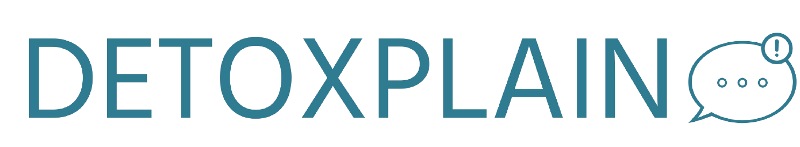
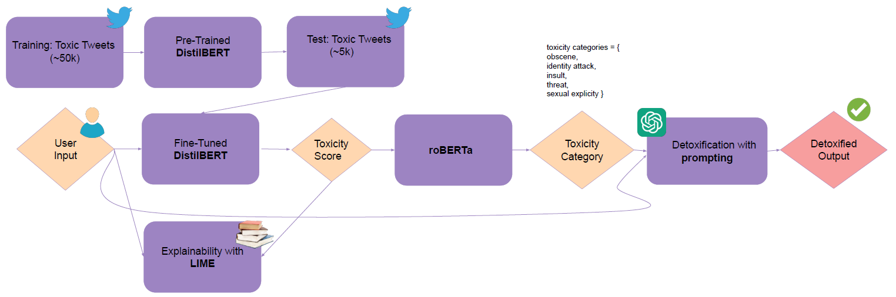
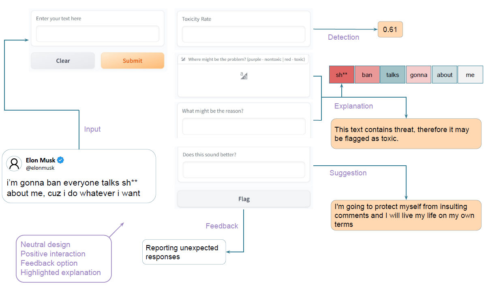

# Detoxplain: Toxic Text Identification and Modification ✏️

## Description 🤖
This project provides a text assistant tool that aims to detect toxicity in text, give explanation as to why it is toxic, and detoxify it to suggest an alternative to the user. Thus, a safe social media environment is achieved.

## Visuals 👁

### System Components and Pipeline:

### User Interface:

## Usage 🤳
You may use this assisting tool to assess the toxicity of your text, analyze why it can be deemed as toxic, and have helpful suggestions to an alternative detoxified version of your text.

## API Keys 🔑

During this project an API key from OpenAI was used. Due to privacy concerns, the key cannot be shared, so please obtain your own key. You could use your own key(s) where it is being mentioned in the notebook as instructed.

## Credits and Acknowledgment 👾
This project is co-authored with Cemre Biltekin and Hasan Selim Yagci.
